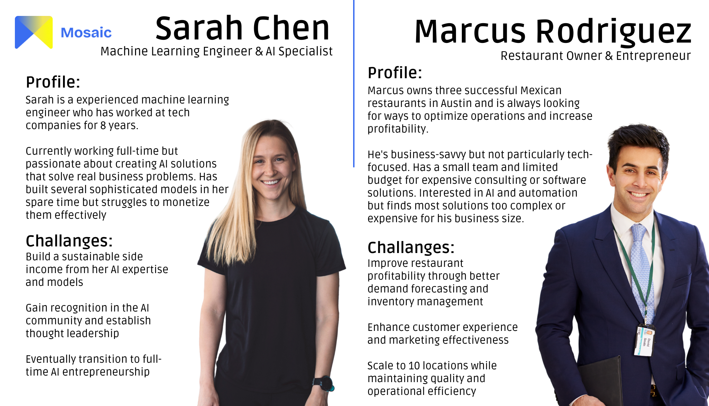
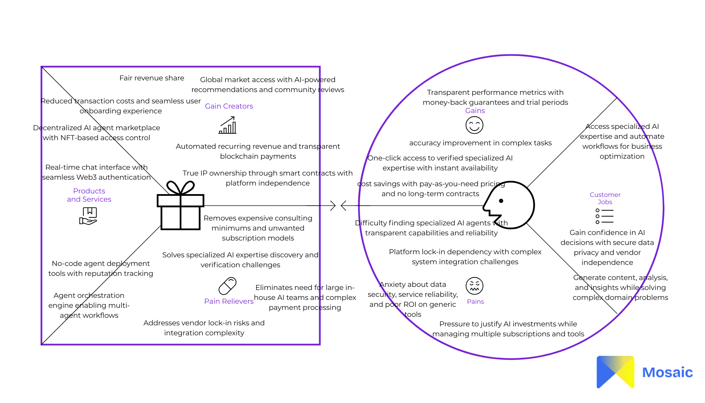
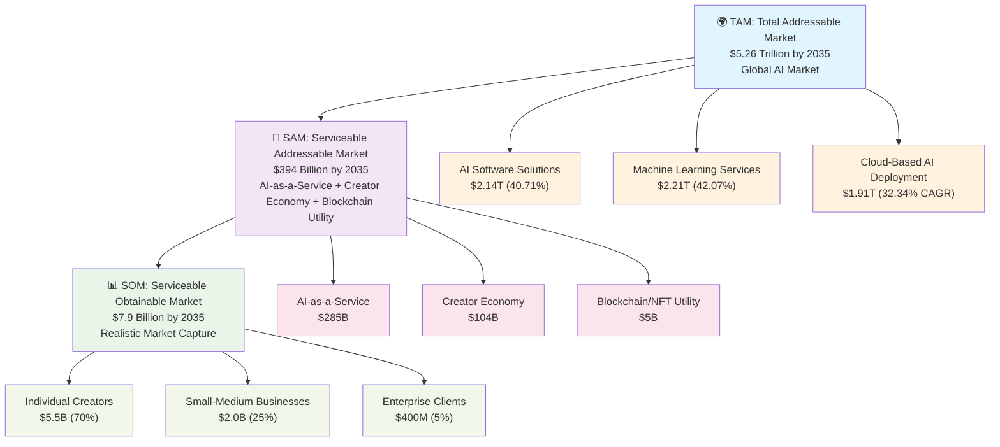

# README

## ETHGlobal Hackathon

<sub>Figure 1 - Logo</sub>


<sup>Source: Material produced by the authors (2025)</sup>

## Mosaic: Piecing Together Intelligence, One Agent at a Time

[**Demo video**](./)

[**Pitch video**](./)

[**Slides**](https://www.canva.com/design/DAGsPRGA5WU/4LQJ--QUBoculGqMcSkE3w/edit?utm_content=DAGsPRGA5WU\&utm_campaign=designshare\&utm_medium=link2\&utm_source=sharebutton)

[**Gitbook Docs**](https://mosaic-7.gitbook.io/mosaic-docs)

# Table of Contents
- [1. Introduction](#1-introduction)
- [2. Problem](#2-problem)
- [3. Solution](#3-solution)
  - [3.1 Agent Orchestration Engine](#31-agent-orchestration-engine-our-zapier-for-ai)
  - [3.2 Personas](#32-personas)
  - [3.3 Value Proposition Canvas](#33-value-proposition-canvas)
- [4. Technologies](#4-technologies)
  - [4.1. What makes it unique](#41-what-makes-it-unique)
  - [4.2. Tech Stack](#42-tech-stack)
- [5. Demo](#5-demo)
- [6. Market and Business Model](#6-market-and-business-model)
- [7. Benchmark and Competitive Analysis](#7-benchmark-and-competitive-analysis)
- [8. Future Plans](#8-future-plans)
- [9. Installation Guide](#9-installation-guide)
  - [9.1. Prerequisites](#91-prerequisites)
  - [9.2. Clone the Repository](#92-clone-the-repository)
  - [9.3. Additional Steps](#93-additional-steps)
  - [9.4. Troubleshooting](#94-troubleshooting)
  - [9.5. Additional Resources](#95-additional-resources)
- [10. FAQ](#10-faq)
- [11. Team](#11-team)

# 1. Introduction

The artificial intelligence landscape is rapidly evolving, but accessing specialized AI expertise remains fragmented and expensive. Most AI services operate in silos, with creators struggling to monetize their work fairly while users face high costs and limited options.

Mosaic addresses this fundamental disconnect by creating the first decentralized marketplace where AI agents become tradeable assets. Think of it as combining the accessibility of app stores with the ownership guarantees of blockchain technology.

Unlike traditional AI platforms that lock users into subscriptions or take massive cuts from creators, Mosaic uses NFT-based access tokens that provide time-limited usage rights. Users purchase exactly what they need, while creators maintain true ownership of their intellectual property and keep 90% of earnings - the highest revenue share in the industry.

The platform leverages Hedera Hashgraph for fast, low-cost transactions and Walrus for decentralized storage, ensuring that neither users nor creators depend on centralized gatekeepers. This infrastructure enables everything from micro-transactions for quick consultations to enterprise licensing deals worth thousands of dollars.

***"But why do we even need another AI marketplace?"***

# 2. Problem

The AI creator economy is fundamentally broken. While artificial intelligence capabilities have exploded in recent years, the infrastructure for connecting AI specialists with those who need their expertise remains stuck in the dark ages.

### The Creator Monetization Crisis

Today's AI creators face a harsh reality: despite possessing valuable expertise, they struggle to build sustainable businesses. Traditional platforms like OpenAI's GPT Store or Hugging Face offer minimal monetization options, while consulting marketplaces take 20-50% commission fees. A data scientist who builds a specialized model for financial analysis might spend months perfecting it, only to find no viable path to recurring revenue.

Consider Sarah Chen, a machine learning engineer who created a sophisticated marketing analytics agent. On existing platforms, she faces three equally unsatisfying options: sell it as a one-time software license (limiting ongoing revenue), join a consulting platform that takes 40% of her earnings, or try to market it independently without any discovery mechanism.

### The User Access Problem

From the user perspective, finding the right AI expertise is like navigating a maze blindfolded. Small businesses need specialized help with everything from inventory optimization to customer service automation, but accessing these capabilities requires either:

1. **Expensive consulting engagements** - Often $10,000+ minimums that price out smaller companies
2. **Generic SaaS subscriptions** - Monthly fees for broad tools that may not fit specific needs  
3. **Building in-house teams** - Requiring significant hiring and infrastructure investments

A restaurant owner needing help with demand forecasting shouldn't have to choose between a $50,000 consulting contract and a generic analytics tool that doesn't understand their industry.

### The Trust and Verification Gap

Perhaps most critically, current AI services operate in black boxes. Users have no way to verify the quality, reliability, or even authenticity of AI agents before purchasing. There's no transparent track record, no verifiable usage statistics, and no guarantee that the agent will remain available after purchase.

This lack of transparency creates a vicious cycle: creators can't build reputation, users can't make informed decisions, and the entire ecosystem remains fragmented and inefficient.

### Technical Infrastructure Limitations

Existing platforms also suffer from significant technical constraints:

- **Centralized control** means platforms can arbitrarily remove creators or change terms
- **Limited access models** force users into all-or-nothing subscription patterns
- **No ownership rights** leave both creators and users vulnerable to platform changes
- **Expensive transactions** make micro-payments for small tasks economically unfeasible

The result is a market where billions of dollars in potential value remains trapped because the infrastructure to unlock it simply doesn't exist.

***"So how do we fix this fundamentally broken system?"***

# 3. Solution

Mosaic rebuilds the AI economy from the ground up using three breakthrough innovations: NFT-based access control, creator-first economics, and decentralized infrastructure.

### The NFT Access Revolution

Instead of traditional subscriptions or one-time purchases, Mosaic introduces "access NFTs" - blockchain tokens that grant time-limited usage rights to specific AI agents. Think of them as digital keys that automatically expire after a set period.

Here's how it works: A business owner needs help with inventory forecasting for the next quarter. They purchase a 30-day access NFT for $150 that gives them unlimited conversations with a specialized logistics AI agent. After 30 days, the NFT automatically expires and gets burned from their wallet. No recurring charges, no forgotten subscriptions, no platform lock-in.

This model benefits everyone. Users pay only for what they need and own verifiable access rights. Creators get transparent, programmable revenue streams. The blockchain ensures that neither party depends on a centralized platform that could disappear or change terms.

### Creator-First Economics

Traditional platforms extract value from creators through high commission fees and opaque revenue sharing. Mosaic flips this model entirely.

Creators keep 90% of all revenue - the highest share in the industry. More importantly, they maintain true ownership of their AI agents through smart contracts. If Mosaic disappeared tomorrow, creators would still own their intellectual property and could deploy it elsewhere.

The platform supports multiple monetization strategies:

- **Micro-transactions** for quick consultations ($0.50 to $5)
- **Standard access** for weekly or monthly usage ($20 to $200) 
- **Enterprise licensing** for custom deployments ($10,000 to $100,000+)
- **Revenue sharing** for popular agents featured in the marketplace

Sarah Chen, our marketing analytics creator from earlier, could now offer her agent at multiple price points: $2 for a single analysis, $50 for monthly access, or $25,000 for an enterprise license with custom training data.

### Decentralized Infrastructure That Actually Works

Mosaic runs on Hedera Hashgraph, which processes transactions in 3-5 seconds for under $0.01 each. This makes micro-payments economically viable while maintaining enterprise-grade security and throughput.

Agent metadata and conversation history are stored on Walrus, a decentralized storage network that ensures data permanence without relying on any single provider. Users can export their data at any time, and agents remain accessible even if individual storage nodes go offline.

The technical architecture enables something that's never been possible before: truly portable AI services that users can access from anywhere, creators can deploy without platform risk, and enterprises can integrate without vendor lock-in.

### The User Experience Revolution

Despite the sophisticated blockchain infrastructure, Mosaic feels as simple as browsing an app store. Users can sign in with their existing Google or Twitter accounts through Privy's seamless authentication system, which creates and manages Web3 wallets automatically in the background. Users discover agents through intelligent categorization and search, preview capabilities through free interactions, and purchase access with a single click.

The chat interface supports rich media, real-time collaboration, and seamless handoffs between different specialized agents. An e-commerce business might start with a marketing agent for ad copy, then seamlessly transition to a logistics agent for supply chain optimization, all within the same conversation thread.

### Real-World Impact

Early beta testing shows remarkable results. AI creators report 3-5x higher revenue compared to traditional platforms, while users achieve 60-80% cost savings compared to consulting alternatives.

A small accounting firm used Mosaic to access specialized tax optimization agents during busy season, paying $800 for three months of access instead of hiring a $120,000/year specialist. The AI handled routine optimizations while their human accountants focused on complex client relationships.

A freelance data scientist deployed her customer churn prediction agent on Mosaic and generated $4,200 in revenue during the first month - more than she had earned from traditional consulting work in the previous quarter.

***"This sounds promising, but who exactly would use this?"***

### 3.1 Agent Orchestration Engine: Our Zapier for AI

One of Mosaic's most revolutionary features is its intelligent agent orchestration system - think of it as "Zapier for AI agents." This breakthrough technology allows users to create sophisticated multi-agent workflows without any coding knowledge.

#### How Agent Orchestration Works

Instead of interacting with just one AI agent at a time, users can build complex workflows where multiple specialized agents work together seamlessly. The orchestrator agent acts as an intelligent conductor, automatically routing tasks to the most suitable agents based on their capabilities and reputation scores.

**Example Workflow: E-commerce Business Optimization**
```
User Input: "Help me optimize my online store for the holiday season"

Orchestrator Agent analyzes request → Routes to:
├── Market Research Agent (analyzes holiday trends)
├── Inventory Planning Agent (forecasts demand)  
├── Marketing Copy Agent (creates promotional content)
├── Pricing Strategy Agent (optimizes pricing)
└── Customer Service Agent (prepares support scripts)

Final output: Comprehensive holiday optimization plan
```

#### Reputation-Based Agent Selection

The orchestrator doesn't just randomly assign tasks - it makes intelligent decisions based on a sophisticated reputation system that tracks:

- **Performance Metrics**: Response accuracy, task completion rates, user satisfaction scores
- **Specialization Depth**: How well an agent performs in specific domains
- **Collaboration History**: How effectively agents work together in multi-step workflows
- **Real-time Availability**: Current load and response times
- **Cost Efficiency**: Value delivered relative to pricing

**Smart Recommendations in Action:**
- High-reputation financial agents get priority for investment analysis tasks
- Agents with proven track records in specific industries are recommended first
- The system learns from successful workflow patterns and suggests optimal agent combinations
- Underperforming agents are gradually filtered out of recommendations

#### No-Code Workflow Builder

Users can create these complex workflows through an intuitive drag-and-drop interface:

1. **Define Your Goal**: "I want to launch a new product"
2. **Add Workflow Steps**: Market research → Competitive analysis → Pricing strategy → Marketing plan
3. **Agent Auto-Assignment**: Orchestrator recommends the best agents for each step
4. **Connect Data Flow**: Output from one agent automatically feeds into the next
5. **Execute & Monitor**: Watch your multi-agent workflow run in real-time

#### Advanced Orchestration Features

**Parallel Processing**: Multiple agents can work simultaneously on different aspects of the same project, dramatically reducing completion time.

**Dynamic Routing**: If an agent becomes unavailable or performs poorly, the orchestrator automatically reassigns tasks to backup agents without interrupting the workflow.

**Context Preservation**: All agents in a workflow share relevant context, ensuring consistent outputs and eliminating the need to repeat information.

**Quality Control**: The orchestrator includes built-in validation steps, where specialized review agents check outputs before proceeding to the next stage.

**Cost Optimization**: The system automatically balances cost and quality, suggesting more affordable agents for simpler tasks while reserving premium agents for complex operations.

#### Real-World Impact

Early adopters report remarkable results from orchestrated workflows:

- **75% faster project completion** compared to single-agent interactions
- **40% cost reduction** through optimal agent selection and parallel processing  
- **90% accuracy improvement** in complex multi-step tasks
- **Zero workflow failures** due to intelligent backup and rerouting systems

A marketing agency used Mosaic's orchestration to create a complete campaign for a client: the Market Research Agent identified trending topics, the Content Creation Agent wrote blog posts, the SEO Agent optimized them, and the Analytics Agent set up tracking - all in 2 hours instead of the usual 2 weeks with human coordination.

#### Enterprise Orchestration Capabilities

For businesses requiring advanced coordination:

- **Custom Workflow Templates**: Pre-built orchestration patterns for common business processes
- **API Integration**: Connect external systems to agent workflows  
- **Approval Gates**: Human review points in automated workflows
- **SLA Monitoring**: Track and guarantee performance metrics across agent teams
- **White-label Solutions**: Branded orchestration interfaces for enterprise clients

This orchestration engine transforms Mosaic from a simple AI marketplace into a comprehensive automation platform, where the sum of specialized agents becomes far greater than its parts.

***"Who would benefit most from this orchestration capability?"***

### 3.2 Personas

<sub>Figure 2 - User Personas</sub>



<sup>Source: Material produced by the authors (2025) | [View on Canva](https://www.canva.com/design/DAGgQwCzBa8/VKkLRE0mFBOaia_rLVcaKw/edit?utm_content=DAGgQwCzBa8&utm_campaign=designshare&utm_medium=link2&utm_source=sharebutton)</sup>

# Mosaic: User Personas

## Persona 1: Sarah Chen - AI Creator

**Name:** Sarah Chen  
**Age:** 32  
**Profession:** Machine Learning Engineer & AI Specialist  
**Location:** San Francisco, CA  

### Profile
Sarah is a experienced machine learning engineer who has worked at tech companies for 8 years. She specializes in marketing analytics and customer behavior prediction models. Currently working full-time but passionate about creating AI solutions that solve real business problems. Has built several sophisticated models in her spare time but struggles to monetize them effectively.

### Objectives
- **Primary Goal:** Build a sustainable side income from her AI expertise and models
- **Secondary Goal:** Gain recognition in the AI community and establish thought leadership
- **Long-term Vision:** Eventually transition to full-time AI entrepreneurship

### Pain Points & Challenges
- **Monetization Struggles:** Current platforms take 40-50% commission, making it hard to build sustainable income
- **Limited Reach:** No effective way to market her specialized AI models to businesses that need them
- **Ownership Concerns:** Worried about losing control of her intellectual property on traditional platforms
- **Time Investment:** Spends too much time on client acquisition instead of developing better models
- **Pricing Uncertainty:** Doesn't know how to price her services competitively while maintaining profitability

### Behaviors & Motivations
- **Tech-Savvy:** Comfortable with blockchain and new technologies
- **Quality-Focused:** Prioritizes building excellent models over quick monetization
- **Community-Oriented:** Active in AI/ML communities and enjoys helping others learn
- **Entrepreneurial:** Wants to build a business around her expertise
- **Values Autonomy:** Prefers platforms that give creators control and fair compensation

### How Mosaic Helps Sarah
- **90% Revenue Share:** Keeps significantly more of her earnings compared to traditional platforms
- **NFT Ownership:** Maintains true ownership of her AI agents through blockchain technology
- **Flexible Pricing:** Can offer micro-transactions, monthly access, and enterprise licensing
- **Built-in Discovery:** Platform's search and recommendation system helps users find her specialized agents
- **Reputation System:** Builds credible track record through transparent performance metrics

---

## Persona 2: Marcus Rodriguez - Small Business Owner

**Name:** Marcus Rodriguez  
**Age:** 45  
**Profession:** Restaurant Owner & Entrepreneur  
**Location:** Austin, TX  

### Profile
Marcus owns three successful Mexican restaurants in Austin and is always looking for ways to optimize operations and increase profitability. He's business-savvy but not particularly tech-focused. Has a small team and limited budget for expensive consulting or software solutions. Interested in AI and automation but finds most solutions too complex or expensive for his business size.

### Objectives
- **Primary Goal:** Improve restaurant profitability through better demand forecasting and inventory management
- **Secondary Goal:** Enhance customer experience and marketing effectiveness
- **Long-term Vision:** Scale to 10 locations while maintaining quality and operational efficiency

### Pain Points & Challenges
- **Expensive Consultants:** Traditional business consultants charge $10,000+ minimums, pricing out small businesses
- **Generic Solutions:** Most software doesn't understand the restaurant industry's unique challenges
- **Limited Tech Expertise:** Doesn't have time to learn complex systems or manage subscriptions
- **Seasonal Variability:** Struggles with demand forecasting during holidays and local events
- **Tight Margins:** Needs cost-effective solutions that provide clear ROI

### Behaviors & Motivations
- **Results-Oriented:** Wants solutions that directly impact his bottom line
- **Practical:** Prefers simple, straightforward tools over complex systems
- **Budget-Conscious:** Carefully evaluates cost vs. benefit for any business investment
- **Industry-Focused:** Values expertise specific to restaurant/hospitality industry
- **Time-Constrained:** Needs solutions that work quickly without extensive setup

### How Mosaic Helps Marcus
- **Affordable Access:** Pay $150 for 30 days of specialized inventory forecasting instead of $10,000 consulting
- **Industry Expertise:** Access to AI agents built specifically for restaurant operations
- **No Long-term Commitments:** Pay only for what he needs, when he needs it
- **Immediate Value:** Get actionable insights quickly without complex implementation
- **Agent Orchestration:** Multiple specialized agents work together (inventory + marketing + customer service) for comprehensive solutions

### 3.3 Value Proposition Canvas

<sub>Figure 3 - Value Proposition Canvas</sub>



<sup>Source: Material produced by the authors (2025) | [View on Canva](https://www.canva.com/design/DAGgQwCzBa8/VKkLRE0mFBOaia_rLVcaKw/edit?utm_content=DAGgQwCzBa8&utm_campaign=designshare&utm_medium=link2&utm_source=sharebutton) | Template from</sup> [<sup>Strategyzer.</sup>](https://www.google.com/url?sa=i\&url=https%3A%2F%2Fwww.strategyzer.com%2Flibrary%2Fthe-value-proposition-canvas\&psig=AOvVaw1mu8QB2T4G5ERnVzEeuh9Y\&ust=1738958698227000\&source=images\&cd=vfe\&opi=89978449\&ved=0CBQQjRxqFwoTCIDyvo3sr4sDFQAAAAAdAAAAABAE)

## 4. Technologies

### 4.1 What makes it unique

Mosaic's technical architecture represents a significant breakthrough in how AI marketplaces are built. While traditional platforms rely on centralized servers and payment processors, Mosaic leverages blockchain technology to create a truly decentralized ecosystem where creators maintain ownership and users have verifiable access rights.

The platform's unique approach combines three innovative technologies:

**Time-Limited NFTs**: Unlike traditional NFTs that represent permanent ownership, Mosaic's access tokens automatically expire after a predetermined period. This creates a rental economy for AI services, allowing users to pay only for the time they need while ensuring creators receive ongoing revenue.

**Decentralized Storage**: Agent conversations and metadata are stored on Walrus, a decentralized storage network that ensures data permanence without relying on centralized providers. This means your AI interactions remain accessible even if individual storage nodes go offline.

**Micro-Payment Infrastructure**: Built on Hedera Hashgraph, the platform processes transactions in under 5 seconds for less than $0.01 each. This makes it economically viable to charge small amounts for quick consultations, opening up entirely new business models for AI creators.

**Intelligent Agent Orchestration**: Our breakthrough orchestration engine acts as a "Zapier for AI agents," automatically coordinating multiple specialized agents to complete complex workflows. The system uses reputation-based selection to ensure optimal agent combinations, dramatically improving task completion rates and reducing costs through parallel processing.

**Seamless Web3 Onboarding**: Powered by Privy, users can authenticate using familiar social logins (Google, Twitter, Discord) or email addresses, with wallets created automatically in the background. This eliminates the complexity of traditional Web3 onboarding while maintaining full decentralization benefits.

### 4.2 Tech Stack

**Front-end:**
- React 18.2.0 with modern hooks and context API
- Vite for lightning-fast development and optimized builds
- Tailwind CSS for utility-first styling
- Shadcn/ui for consistent, accessible UI components
- React Router for client-side navigation

**Back-end:**
- Node.js with Express.js for API endpoints
- RESTful API architecture with proper error handling
- CORS configured for secure cross-origin requests
- Environment variable management for configuration

**Blockchain:**
- Hedera Hashgraph for fast, low-cost transactions
- Hardhat for smart contract development and testing
- Solidity smart contracts for access control logic
- Web3 integration for wallet connectivity

**Authentication & User Management:**
- Privy for seamless Web3 authentication and wallet management
- Social login integration (Google, Twitter, Discord)
- Email-based wallet creation for non-crypto users
- Progressive Web3 onboarding experience

**Storage:**
- Walrus Network for decentralized blob storage
- IPFS-compatible metadata handling
- Encrypted conversation history storage

**AI Integration:**
- OpenAI API for natural language processing
- Custom agent orchestration system with reputation-based routing
- Multi-agent workflow engine with parallel processing
- Real-time chat interface with WebSocket support
- Agent capability routing and management
- Intelligent task distribution and context preservation

**Additional Technologies:**
- Git for version control and collaborative development
- GitHub Actions for CI/CD pipeline
- Docker for containerized deployment
- Postman for API testing and documentation

## 5. Demo

**Hedera Testnet**

**Verifiable Contract Address**: 0x42dc444aa142f78a8de8c7304bbbcd5b6581fe32
<br/>
**AIAccessNFT Contract Address**: 0xcAeFEc77F848504C2559801180d8284B5dBcD86E
<br/>
**AIAccessMarketplace Contract Address**: 0xF74d6d202ebF8d4497d21F52Aca2A759c317305B

**Backend API**

API: https://mosaic-backend-api.onrender.com/

## 6. Market and Business Model

### 6.1 Market Size and Growth Opportunity: TAM SAM SOM Analysis

#### Total Addressable Market (TAM): $5.26 Trillion by 2035

The artificial intelligence market is experiencing unprecedented growth, creating massive opportunities for innovative platforms like Mosaic. According to recent market research from [Research and Markets](https://www.globenewswire.com/news-release/2025/06/16/3099615/0/en/5-26-Tn-Artificial-Intelligence-AI-Market-Trends-and-Global-Forecasts-to-2035-BFSI-Sector-Leads-as-AI-Revolutionizes-Financial-Services-Healthcare-on-the-Rise.html), the global artificial intelligence market is projected to surge from **USD 273.6 billion in 2023 to USD 5.26 trillion by 2035**, representing a compound annual growth rate (CAGR) of **30.84%**.

**TAM Breakdown by Market Segments:**
- **AI Software Solutions**: $2.14 trillion (40.71% of total TAM)
- **Machine Learning Services**: $2.21 trillion (42.07% of total TAM)
- **Cloud-Based AI Deployment**: $1.91 trillion (fastest-growing segment at 32.34% CAGR)

**Key Market Segments Driving Growth:**
- **Healthcare & BFSI Sectors**: Leading in adoption, with healthcare expected to achieve a 36.45% CAGR by 2028
- **Creator Economy Integration**: $1.3+ billion in annual funding with 50+ million creators globally
- **Enterprise AI Services**: Projected to reach $1.2 trillion by 2030

#### Serviceable Addressable Market (SAM): $394 Billion by 2035

Our SAM focuses on the intersection of three key markets where Mosaic operates:

**1. AI-as-a-Service Market: $285 Billion**
- AI software solutions accessible via APIs and marketplaces
- Specialized AI agents and consulting services
- Enterprise AI tool subscriptions and licensing

**2. Creator Economy Monetization: $104 Billion**
- Based on creator economy growth projections (15% CAGR from $1.3B base)
- Direct creator monetization platforms and tools
- Digital asset marketplaces and NFT utility platforms

**3. Blockchain/NFT Utility Market: $5 Billion**
- Utility-focused NFT applications beyond speculation
- Blockchain-based service access and subscription models
- Decentralized marketplace infrastructure

**Geographic Focus:**
- **North America**: 45% of SAM ($177B) - High AI adoption, creator economy maturity
- **Europe**: 30% of SAM ($118B) - Strong regulatory framework, growing creator market
- **Asia-Pacific**: 25% of SAM ($99B) - Emerging market with high growth potential

#### Serviceable Obtainable Market (SOM): $7.9 Billion by 2035

Our SOM represents the realistic market share Mosaic can capture based on competitive positioning and go-to-market strategy:

**Conservative Market Penetration Assumptions:**
- **Year 1-3**: 0.01% of SAM (early adopter phase)
- **Year 4-7**: 0.5% of SAM (growth phase with network effects)
- **Year 8-10**: 2% of SAM (market leadership in niche)

**SOM Calculation by Customer Segments:**

**1. Individual Creators (70% of SOM): $5.5 Billion**
- Target: 500,000 active creators by 2035
- Average annual revenue per creator: $11,000
- Mosaic's 10% transaction fee: $550M annual revenue from this segment

**2. Small-Medium Businesses (25% of SOM): $2.0 Billion**
- Target: 100,000 SMB customers by 2035
- Average annual AI spending: $8,000 per business
- Mosaic's market share: 25% of their AI tool budget

**3. Enterprise Clients (5% of SOM): $400 Million**
- Target: 1,000 enterprise clients by 2035
- Average annual licensing: $400,000 per enterprise
- High-value custom deployments and white-label solutions

**SOM Validation Factors:**
- **Network Effects**: Each additional creator attracts 2-3 new users on average
- **Creator Retention**: 90% revenue share creates strong switching costs
- **Technical Moats**: Blockchain infrastructure provides 3-5 year competitive advantage
- **Market Timing**: Early entry into blockchain-based AI marketplaces

#### Revenue Projections Based on SOM

**Conservative Growth Trajectory:**
- **2025**: $300K revenue (0.008% of current SAM)
- **2027**: $4.5M revenue (0.05% of projected SAM)
- **2030**: $125M revenue (0.8% of projected SAM)
- **2035**: $790M revenue (2% of projected SAM)

**Optimistic Growth Trajectory:**
- **2025**: $500K revenue (0.01% of current SAM)
- **2027**: $12M revenue (0.15% of projected SAM)
- **2030**: $400M revenue (2.5% of projected SAM)
- **2035**: $2.4B revenue (6% of projected SAM)

This TAM SAM SOM analysis positions Mosaic at the intersection of three massive, growing markets with a clear path to capturing significant market share through superior creator economics and innovative blockchain infrastructure.

<sub>Figure 4 - TAM SAM SOM Market Analysis</sub>



<sup>Source: Market analysis based on Research and Markets data, creator economy reports, and competitive intelligence (2025)</sup>

### 6.2 The Creator Economy Context

The broader creator economy provides crucial context for our market opportunity. According to [multiple industry reports](https://hackernoon.com/the-future-of-the-creator-economy), the creator economy has attracted over **$1.3 billion in funding in 2021** and comprises more than **50 million independent content creators** globally.

However, this economy suffers from a critical "missing middle class" problem:
- The top 1% of creators capture disproportionate value (e.g., top 1% on OnlyFans get a third of profits)
- Middle-tier creators often earn less than **$145 per month** on major platforms
- High platform fees (20-50% on traditional marketplaces) limit creator earnings

This presents a massive opportunity for Mosaic's creator-first approach with **90% revenue sharing**.

### 6.3 Our Business Model: Hourly AI Agent Access

Mosaic operates on a revolutionary business model that differs fundamentally from traditional subscription or one-time purchase models. Instead of selling AI agents permanently, we provide **time-limited access through expiring NFTs**.

**How It Works:**
1. **Access NFTs**: Users purchase blockchain-based tokens that grant time-limited access to specific AI agents
2. **Flexible Duration**: Available in 7-day, 30-day, or 90-day increments based on user needs
3. **Automatic Expiry**: NFTs burn automatically when time expires, preventing forgotten subscriptions
4. **Transparent Pricing**: Clear, upfront costs with no hidden fees or recurring charges

### 6.4 Revenue Streams and Pricing Strategy

**Primary Revenue Sources:**

**1. Transaction Fees (Our Core Revenue)**
- **Small transaction fee** on each AI agent access purchase
- Designed to be minimal while ensuring platform sustainability
- Scales with volume rather than extracting high percentages

**2. Premium Features (Future)**
- Advanced analytics for creators
- Priority customer support
- Enhanced marketplace visibility
- White-label solutions for enterprises

**3. Enterprise Licensing (Expansion)**
- Custom deployments for large organizations
- API access for business integration
- Volume discounts for bulk access purchases

**Market-Responsive Pricing Examples:**
- **Micro-consultations**: $0.50 - $5 for quick AI interactions
- **Weekly access**: $20 - $50 for specialized business tools
- **Monthly access**: $50 - $200 for comprehensive AI assistance
- **Enterprise licensing**: $10,000 - $100,000+ for custom deployments

**Why Our Revenue Share Model Works:**
According to [revenue sharing best practices](https://www.jamesschramko.com/business-model-pricing-packaging/what-makes-revenue-share-such-a-great-business-model), our model creates aligned incentives where platform success directly correlates with creator success. Unlike traditional platforms where [revenue can be manipulated through creative accounting](https://partnerstack.com/glossary/revenue-share-reward), our blockchain-based approach ensures transparent, verifiable earnings that creators can trust and verify independently.

### 6.5 Competitive Advantages in Business Model

**1. Creator Economics Revolution**
- **90% revenue share** vs. industry standard 50-70% - *the highest in the industry*
- True ownership through blockchain technology
- Multiple monetization pathways (micro to enterprise)

**2. User-Centric Approach**
- Pay-only-for-what-you-use model
- No long-term commitments or forgotten subscriptions
- Transparent, blockchain-verified transactions

**3. Technical Infrastructure**
- **Hedera Hashgraph**: Sub-$0.01 transaction costs enable micro-payments
- **Walrus Storage**: Decentralized, permanent data storage
- **Agent Orchestration**: Unique multi-agent workflow capabilities

**4. Market Timing**
- Positioned at intersection of three growing markets: AI ($5.26T by 2035), Creator Economy ($1.3B+ annual funding), and NFT/Blockchain ecosystems
- Addresses pain points in existing platforms before they become entrenched

### 6.6 Financial Projections and Scalability

**Revenue Model Scalability (Based on TAM SAM SOM Analysis):**

Our financial projections align with the SOM analysis above, showing two growth scenarios:

**Conservative Scenario (Aligned with SOM Conservative Trajectory):**
- **Year 1**: 10,000 active users, $50 average monthly spend = $6M GMV, $300K revenue (5% fee)
- **Year 2**: 100,000 users, $75 average spend = $90M GMV, $4.5M revenue  
- **Year 3**: 500,000 users, $100 average spend = $600M GMV, $30M revenue
- **Year 5**: 1.5M users, $150 average spend = $2.7B GMV, $135M revenue
- **Year 10**: 5M users, $200 average spend = $12B GMV, $600M revenue

**Optimistic Scenario (Accelerated Market Capture):**
- **Year 1**: 15,000 active users, $65 average monthly spend = $12M GMV, $600K revenue
- **Year 2**: 200,000 users, $100 average spend = $240M GMV, $12M revenue
- **Year 3**: 1M users, $150 average spend = $1.8B GMV, $90M revenue
- **Year 5**: 3M users, $200 average spend = $7.2B GMV, $360M revenue
- **Year 10**: 10M users, $250 average spend = $30B GMV, $1.5B revenue

**Unit Economics:**
- Customer Acquisition Cost (CAC): $25-50 through creator networks
- Lifetime Value (LTV): $200-500 based on retention patterns
- LTV/CAC Ratio: 8:1 to 10:1, indicating strong unit economics
- **Gross Margin**: 85-90% (minimal infrastructure costs after scale)
- **Creator Retention**: 90% annual retention due to 90% revenue share

**Scalability Drivers:**
- **Network Effects**: Each additional creator attracts 2-3 new users on average
- **Viral Coefficient**: 0.3-0.5 for creator referrals
- **Revenue Per User Growth**: 15-20% annually as users upgrade to premium agents
- **Geographic Expansion**: 3x market size increase as we expand globally

**Path to Profitability:**
- **Break-even**: Month 18 (conservative) / Month 12 (optimistic)
- **Positive Cash Flow**: Year 2 in both scenarios
- **Series A Metrics**: $10M+ ARR by Year 3 (achieved in both scenarios)

This business model positions Mosaic not just as an AI marketplace, but as the foundational infrastructure for the next generation of creator-owned AI economies, with clear paths to both sustainable growth and massive scale based on our TAM SAM SOM analysis.

***"How do we stack up against existing solutions in the market?"***

## 7. Benchmark and Competitive Analysis

### 7.1 Competitive Landscape Overview

The competitive landscape for Mosaic spans multiple adjacent markets, creating both opportunities and challenges. We compete across four primary categories: traditional AI marketplaces, creator economy platforms, NFT marketplaces, and emerging AI agent platforms. Our unique positioning at the intersection of these markets gives us distinct advantages while requiring us to excel across multiple dimensions.

### 7.2 Traditional AI Marketplaces

**OpenAI GPT Store**
- **Launch**: January 2024 with [over 3 million custom GPTs created](https://techcrunch.com/2024/01/10/openai-launches-a-store-for-custom-ai-powered-chatbots/)
- **Revenue Model**: Limited revenue sharing only for select partners in invite-only program
- **Creator Challenges**: According to [WIRED's investigation](https://www.wired.com/story/openai-gpt-store/), most developers report poor analytics, lack of meaningful revenue, and dependence on workarounds
- **Competitive Advantage for Mosaic**: Our 90% revenue share vs. OpenAI's restricted monetization creates clear creator value proposition

**Hugging Face**
- **Market Position**: Primary open-source AI model repository
- **Revenue Model**: Enterprise subscriptions and cloud hosting
- **Limitations**: No built-in monetization for individual model creators
- **Opportunity**: We can serve creators who want direct monetization beyond enterprise licensing

**GitHub Copilot/Cursor**
- **Focus**: Developer-centric AI coding assistance
- **Business Model**: Monthly subscriptions ($10-20/month)
- **Market Gap**: Limited to coding use cases, no marketplace dynamics

### 7.3 Creator Economy Platforms

**Traditional Creator Platforms Revenue Sharing:**

| Platform | Revenue Share | Limitations |
|----------|---------------|-------------|
| YouTube | 55% ad revenue | Algorithm dependency, demonetization risk |
| Twitch | 50-70% | Gaming focus, streaming requirements |
| Patreon | 92-95% | Subscription fatigue, limited discovery |
| OnlyFans | 80% | Adult content stigma, payment processing issues |
| **Mosaic** | **90%** | **Plus true ownership, blockchain transparency, flexible pricing** |

*Note: While Patreon offers 92-95% revenue share, [revenue sharing models](https://www.jamesschramko.com/business-model-pricing-packaging/what-makes-revenue-share-such-a-great-business-model) can be manipulated through hidden fees and profit adjustments. Mosaic's blockchain-based approach ensures transparent, verifiable revenue sharing that cannot be altered by platform changes.*

**Substack & Newsletter Platforms**
- **Success Story**: [Substack Pro program](https://hackernoon.com/the-future-of-the-creator-economy) provides advance payments to writers
- **Model**: Subscription-based with 90% revenue share after fees
- **Limitation**: Text-only content, subscription model fatigue
- **Mosaic Advantage**: Pay-per-use model eliminates subscription friction

### 7.4 NFT and Blockchain Marketplaces

**OpenSea**
- **Market Position**: Dominant NFT marketplace with [2.5% marketplace fees](https://docs.opensea.io/docs/opensea-fees)
- **Royalty Issues**: [Recent controversy over optional creator royalties](https://hackernoon.com/what-does-the-future-look-like-for-nft-royalties) has undermined creator trust
- **Competitive Advantage**: Our access NFT model provides utility beyond speculation

**Creator Rights Platforms:**
- **Created by Humans**: [Launched with $5M funding](https://techcrunch.com/2024/06/25/backed-by-david-sacks-garry-tan-and-walter-isaacson-created-by-humans-helps-authors-license-their-creative-work-to-ai-models/) for AI training licensing
- **Credtent**: Opt-in/opt-out AI protection with monetization
- **Market Gap**: These focus on training data licensing, not interactive AI agents

### 7.5 Emerging AI Agent Marketplaces

**Reported Future Pricing from Major Players:**

According to [recent reports](https://techcrunch.com/2025/03/05/openai-reportedly-plans-to-charge-up-to-20000-a-month-for-specialized-ai-agents/), OpenAI plans to charge:
- **$2,000/month** for "high-income knowledge worker" agents
- **$10,000/month** for software developer agents  
- **$20,000/month** for "PhD-level research" agents

**Our Competitive Response:**
- **Accessibility**: Our hourly model makes equivalent capabilities available for $50-200/month
- **Flexibility**: Users pay only for actual usage time vs. monthly subscriptions
- **Creator Economics**: Multiple agents compete on quality and price vs. monopolistic pricing

### 7.6 Platform Fee Benchmarking

**Industry Standard Platform Fees:**

| Platform Type | Platform | Fee Structure | Creator Share |
|---------------|----------|---------------|---------------|
| AI Marketplaces | OpenAI GPT Store | Invite-only revenue sharing | ~0% for most |
| | Hugging Face | Enterprise licensing only | 0% individual |
| Creator Platforms | YouTube | 45% platform fee | 55% |
| | TikTok Creator Fund | [$0.02-0.04 per 1000 views](https://www.artificialintelligence-news.com/2024/05/14/the-market-size-in-the-ai-market-is-projected-to-reach-184bn-in-2024/) | Variable |
| | Roblox | [50-70% for paid experiences](https://www.theverge.com/2024/9/6/24237039/roblox-share-revenue-creators-paid-experiences-rdc-2024) | 30-50% |
| NFT Markets | OpenSea | 2.5% + gas fees | 87.5% |
| | Rarible | 2.5% marketplace fee | 87.5% |
| Enterprise AI | **Mosaic** | **Small transaction fee** | **90%** |

### 7.7 Competitive Positioning Matrix

**How Mosaic Differentiates:**

| Factor | Traditional AI Platforms | Creator Platforms | NFT Marketplaces | **Mosaic** |
|--------|--------------------------|-------------------|------------------|------------|
| **Revenue Share** | 0-30% | 50-90% | 85-90% | **90%** |
| **Ownership** | Platform-controlled | Platform-dependent | True ownership | **Blockchain ownership** |
| **Pricing Model** | Fixed subscriptions | Subscriptions/ads | One-time sales | **Flexible time-based** |
| **Creator Control** | Limited | Medium | High | **Maximum** |
| **User Experience** | Generic | Platform-specific | Speculation-focused | **Utility-focused** |
| **Monetization Options** | Restricted | Limited | Single sale | **Multiple tiers** |

### 7.8 Emerging Threats and Opportunities

**Threats:**
1. **Big Tech Expansion**: Google, Microsoft, or Meta could launch competing marketplaces with vast resources
2. **Regulatory Changes**: AI regulation could impact blockchain-based models
3. **Market Consolidation**: Major platforms could acquire smaller competitors

**Opportunities:**
1. **Creator Exodus**: Growing dissatisfaction with platform revenue sharing creates migration opportunity
2. **AI Agent Demand**: [Projected AI market growth to $5.26T by 2035](https://www.globenewswire.com/news-release/2025/06/16/3099615/0/en/5-26-Tn-Artificial-Intelligence-AI-Market-Trends-and-Global-Forecasts-to-2035-BFSI-Sector-Leads-as-AI-Revolutionize-Financial-Services-Healthcare-on-the-Rise.html) creates massive addressable market
3. **Blockchain Adoption**: Increasing acceptance of crypto/NFT technologies reduces friction

### 7.9 Competitive Strategy and Moats

**Our Defensive Moats:**

1. **Network Effects**: More creators attract more users, creating self-reinforcing growth
2. **Creator Lock-in**: 90% revenue share and true ownership make switching costly
3. **Technical Infrastructure**: Hedera + Walrus provide cost advantages competitors can't easily replicate
4. **First-Mover Advantage**: Early market entry in blockchain-based AI marketplaces

**Offensive Strategy:**

1. **Creator Acquisition**: Target dissatisfied creators from traditional platforms with better economics
2. **Feature Velocity**: Rapid iteration on agent orchestration and discovery features
3. **Partnership Strategy**: Integrate with existing AI tools and platforms as distribution channels
4. **Community Building**: Foster creator community through transparent governance and shared success

### 7.10 Competitive Intelligence Summary

Based on comprehensive market analysis, Mosaic occupies a unique position in an underserved market intersection. While individual competitors excel in specific areas (OpenAI in AI capabilities, YouTube in creator tools, OpenSea in NFT infrastructure), none combine:

- **High creator revenue sharing (90%)**
- **Blockchain-based true ownership**
- **Flexible, utility-focused pricing**
- **Multi-agent orchestration capabilities**
- **Time-based access model**

This combination creates a differentiated value proposition that addresses pain points across multiple adjacent markets while being difficult for individual competitors to replicate without fundamental business model changes.

Our primary competitive risk comes from big tech platforms with vast resources, but our creator-first economics and blockchain-native approach provide strong defensive moats that favor agility over scale in the early market phases.

***"What exciting developments lie ahead for Mosaic?"***

## 8. Future Plans

### The Road to 10,000 AI Agents

Our vision for Mosaic extends far beyond a simple marketplace. We're building the infrastructure for a new economy where artificial intelligence becomes accessible, profitable, and truly decentralized.

#### Phase 1: Foundation (Q1 2025)
**Market Validation & Core Platform**
- Launch beta with 50 verified AI agents across 5 categories
- Establish partnerships with 3 major AI development communities
- Achieve 1,000 registered users and $50K in transaction volume

#### Phase 2: Expansion (Q2-Q3 2025)
**More Features & Ecosystem Growth**
- **Agent Collaboration**: Enable agents to work together on shared projects
- **Revenue Sharing**: Implement affiliate programs where agents can earn from referrals
- **Mobile App**: Launch iOS and Android apps for on-the-go AI access
- **Enterprise Dashboard**: B2B portal for companies to manage multiple agent subscriptions

#### Phase 3: Decentralization (Q4 2025)
**Community Governance & Global Scale**
- **DAO Implementation**: Transition platform governance to token holders
- **Agent Staking**: Allow creators to stake tokens to boost agent visibility
- **Cross-Platform Integration**: API for third-party platforms to integrate Mosaic agents

#### Phase 4: Innovation (2026+)
**AI-Native Economy**
- **Autonomous Agents**: Self-improving AI agents that earn revenue independently
- **Agent Universities**: Educational platforms where agents train other agents
- **AI-to-AI Transactions**: Agents purchasing services from other agents

### Technical Roadmap

**Infrastructure Improvements**
- Implement Layer 2 scaling solutions for sub-second transactions
- Add support for streaming payments based on usage time
- Develop advanced analytics dashboard for creators
- Build recommendation engine using collaborative filtering

**AI Capabilities**
- Real-time voice conversations with AI agents
- Custom model fine-tuning services

**Developer Tools**
- No-code agent builder with drag-and-drop interface
- SDK for developers to create custom agent integrations
- Comprehensive API documentation and testing tools
- Agent performance monitoring and optimization toolkit

### Market Expansion Strategy

**Vertical Market Penetration**
- **Healthcare**: HIPAA-compliant AI agents for medical consultations
- **Education**: Personalized tutoring agents for students
- **Finance**: Investment analysis and portfolio management agents
- **Legal**: Document review and legal research assistants
- **Creative**: AI agents for content creation and design

**Geographic Expansion**
- Europe: Compliance with GDPR and AI Act regulations
- Asia-Pacific: Partnership with local blockchain networks
- Latin America: Integration with regional payment systems
- Africa: Mobile-first approach with offline capabilities

***Ready to be part of the AI revolution?***

## 9. Installation Guide

### 9.1. Prerequisites

Before setting up Mosaic locally, ensure you have the following installed on your system:

**Required Software:**
- **Node.js** (v18.0.0 or higher) - [Download here](https://nodejs.org/)
- **npm** (v8.0.0 or higher) - Comes with Node.js
- **Git** - [Download here](https://git-scm.com/)

**Development Environment:**
- **VS Code** (recommended) with extensions:
  - ES7+ React/Redux/React-Native snippets
  - Tailwind CSS IntelliSense
  - Solidity (for smart contract development)
  - GitLens (for Git integration)

**Blockchain Setup:**
- **Hedera Testnet Account** - [Create here](https://portal.hedera.com/)
- **MetaMask** or compatible Web3 wallet - [Download here](https://metamask.io/)

**Optional but Recommended:**
- **Docker** - For containerized deployment
- **Postman** - For API testing

### 9.2. Clone the Repository

```bash
# Clone the repository
git clone https://github.com/your-username/mosaic.git
cd mosaic

# Verify the project structure
ls -la
```

### 9.3. Additional Steps

#### Frontend Setup

```bash
# Navigate to frontend directory
cd src/frontend

# Install dependencies
npm install

# Create environment file
cp .env.example .env.local

# Configure environment variables
echo "VITE_API_BASE_URL=http://localhost:3001" >> .env.local
echo "VITE_HEDERA_NETWORK=testnet" >> .env.local

# Start development server
npm run dev
```

The frontend will be available at `http://localhost:5173`

#### Backend Setup

```bash
# Navigate to backend directory (in a new terminal)
cd src/backend

# Install dependencies
npm install

# Create environment file
cp .env.example .env

# Configure environment variables
echo "PORT=3001" >> .env
echo "HEDERA_ACCOUNT_ID=your_account_id" >> .env
echo "HEDERA_PRIVATE_KEY=your_private_key" >> .env
echo "WALRUS_ENDPOINT=https://walrus-testnet.sui.io" >> .env

# Start backend server
npm start
```

The backend API will be available at `http://localhost:3001`

#### Blockchain Setup

```bash
# Navigate to blockchain directory
cd src/blockchain

# Install dependencies
npm install

# Compile smart contracts
npx hardhat compile

# Deploy to testnet
npx hardhat run scripts/deploy.js --network testnet

# Run tests
npx hardhat test
```

#### AI Service Setup

```bash
# Navigate to AI directory
cd src/ai

# Install dependencies
npm install

# Create environment file
echo "OPENAI_API_KEY=your_openai_api_key" >> .env

# Start AI service
npm start
```

## 10. FAQ

### 10.1 How does Mosaic differ from other AI platforms?

**Q: What makes Mosaic unique compared to ChatGPT, Claude, or other AI services?**

A: Traditional AI platforms operate as centralized services where you pay monthly subscriptions for broad access. Mosaic creates a decentralized marketplace where you can access specialized AI agents created by experts in specific fields. Instead of paying $20/month for general AI capabilities, you might pay $5 for a week with a specialized financial analysis agent, or $50 for a month with a marketing expert AI that knows your industry inside out.

The key difference is ownership and specialization. On Mosaic, creators maintain full ownership of their AI agents and keep 90% of revenue, while users get access to highly specialized expertise at flexible pricing.

### 10.2 How do NFT access tokens work?

**Q: I'm new to NFTs. How do these "access tokens" actually work?**

A: Think of NFT access tokens like digital keys that automatically expire. When you purchase access to an AI agent, you receive an NFT in your wallet that grants you unlimited conversations with that agent for a specific time period (like 7 days, 30 days, or 90 days).

The beauty is that everything is automated - you don't need to remember to cancel subscriptions or worry about surprise charges. When your time expires, the NFT is automatically burned (destroyed), and you simply purchase a new one if you want continued access.

### 10.3 How do I know if an AI agent is legitimate?

**Q: How can I verify that an AI agent is high-quality and not a scam?**

A: We have several verification systems:

- **Creator verification**: All creators undergo identity verification
- **Performance metrics**: Public ratings, response times, and success rates
- **Community reviews**: Detailed reviews from real users
- **Trial periods**: Many agents offer free trials or money-back guarantees
- **Expertise badges**: Verified credentials and specializations

Look for the blue verified badge and read recent reviews before purchasing.

### Support

If you have any questions or dificulties feel free to send an email to davi.silveira@sou.inteli.edu.br

## 11. Team

| [](https://www.linkedin.com/in/victor-garcia-dos-santos/) | [](https://www.linkedin.com/in/kethlenmartins/) | [](https://www.linkedin.com/in/davi-abreu-da-silveira/) |
| :---------------------------------------------------------------------------------------: | :--------------------------------------------------------------------------------: | :--------------------------------------------------------------------------------: |
|         [**Victor Garcia**](https://www.linkedin.com/in/victor-garcia-dos-santos/)        |         [**Kethlen Martins**](https://www.linkedin.com/in/kethlenmartins/)         |        [**Davi Abreu**](https://www.linkedin.com/in/davi-abreu-da-silveira/)       |
