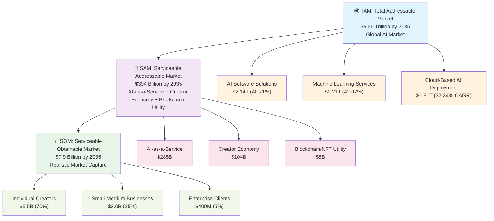

# 6. Market and Business Model

## 6.1 Market Size and Growth Opportunity: TAM SAM SOM Analysis

### Total Addressable Market (TAM): $5.26 Trillion by 2035

The artificial intelligence market is experiencing unprecedented growth, creating massive opportunities for innovative platforms like Mosaic. According to recent market research from [Research and Markets](https://www.globenewswire.com/news-release/2025/06/16/3099615/0/en/5-26-Tn-Artificial-Intelligence-AI-Market-Trends-and-Global-Forecasts-to-2035-BFSI-Sector-Leads-as-AI-Revolutionizes-Financial-Services-Healthcare-on-the-Rise.html), the global artificial intelligence market is projected to surge from **USD 273.6 billion in 2023 to USD 5.26 trillion by 2035**, representing a compound annual growth rate (CAGR) of **30.84%**.

**TAM Breakdown by Market Segments:**
- **AI Software Solutions**: $2.14 trillion (40.71% of total TAM)
- **Machine Learning Services**: $2.21 trillion (42.07% of total TAM)
- **Cloud-Based AI Deployment**: $1.91 trillion (fastest-growing segment at 32.34% CAGR)

**Key Market Segments Driving Growth:**
- **Healthcare & BFSI Sectors**: Leading in adoption, with healthcare expected to achieve a 36.45% CAGR by 2028
- **Creator Economy Integration**: $1.3+ billion in annual funding with 50+ million creators globally
- **Enterprise AI Services**: Projected to reach $1.2 trillion by 2030

### Serviceable Addressable Market (SAM): $394 Billion by 2035

Our SAM focuses on the intersection of three key markets where Mosaic operates:

**1. AI-as-a-Service Market: $285 Billion**
- AI software solutions accessible via APIs and marketplaces
- Specialized AI agents and consulting services
- Enterprise AI tool subscriptions and licensing

**2. Creator Economy Monetization: $104 Billion**
- Based on creator economy growth projections (15% CAGR from $1.3B base)
- Direct creator monetization platforms and tools
- Digital asset marketplaces and NFT utility platforms

**3. Blockchain/NFT Utility Market: $5 Billion**
- Utility-focused NFT applications beyond speculation
- Blockchain-based service access and subscription models
- Decentralized marketplace infrastructure

**Geographic Focus:**
- **North America**: 45% of SAM ($177B) - High AI adoption, creator economy maturity
- **Europe**: 30% of SAM ($118B) - Strong regulatory framework, growing creator market
- **Asia-Pacific**: 25% of SAM ($99B) - Emerging market with high growth potential

### Serviceable Obtainable Market (SOM): $7.9 Billion by 2035

Our SOM represents the realistic market share Mosaic can capture based on competitive positioning and go-to-market strategy:

**Conservative Market Penetration Assumptions:**
- **Year 1-3**: 0.01% of SAM (early adopter phase)
- **Year 4-7**: 0.5% of SAM (growth phase with network effects)
- **Year 8-10**: 2% of SAM (market leadership in niche)

**SOM Calculation by Customer Segments:**

**1. Individual Creators (70% of SOM): $5.5 Billion**
- Target: 500,000 active creators by 2035
- Average annual revenue per creator: $11,000
- Mosaic's 10% transaction fee: $550M annual revenue from this segment

**2. Small-Medium Businesses (25% of SOM): $2.0 Billion**
- Target: 100,000 SMB customers by 2035
- Average annual AI spending: $8,000 per business
- Mosaic's market share: 25% of their AI tool budget

**3. Enterprise Clients (5% of SOM): $400 Million**
- Target: 1,000 enterprise clients by 2035
- Average annual licensing: $400,000 per enterprise
- High-value custom deployments and white-label solutions

**SOM Validation Factors:**
- **Network Effects**: Each additional creator attracts 2-3 new users on average
- **Creator Retention**: 90% revenue share creates strong switching costs
- **Technical Moats**: Blockchain infrastructure provides 3-5 year competitive advantage
- **Market Timing**: Early entry into blockchain-based AI marketplaces

### Revenue Projections Based on SOM

**Conservative Growth Trajectory:**
- **2025**: $300K revenue (0.008% of current SAM)
- **2027**: $4.5M revenue (0.05% of projected SAM)
- **2030**: $125M revenue (0.8% of projected SAM)
- **2035**: $790M revenue (2% of projected SAM)

**Optimistic Growth Trajectory:**
- **2025**: $500K revenue (0.01% of current SAM)
- **2027**: $12M revenue (0.15% of projected SAM)
- **2030**: $400M revenue (2.5% of projected SAM)
- **2035**: $2.4B revenue (6% of projected SAM)

This TAM SAM SOM analysis positions Mosaic at the intersection of three massive, growing markets with a clear path to capturing significant market share through superior creator economics and innovative blockchain infrastructure.

Figure 4 - TAM SAM SOM Market Analysis

Source: Market analysis based on Research and Markets data, creator economy reports, and competitive intelligence (2025)

## 6.2 The Creator Economy Context

The broader creator economy provides crucial context for our market opportunity. According to [multiple industry reports](https://hackernoon.com/the-future-of-the-creator-economy), the creator economy has attracted over **$1.3 billion in funding in 2021** and comprises more than **50 million independent content creators** globally.

However, this economy suffers from a critical "missing middle class" problem:
- The top 1% of creators capture disproportionate value (e.g., top 1% on OnlyFans get a third of profits)
- Middle-tier creators often earn less than **$145 per month** on major platforms
- High platform fees (20-50% on traditional marketplaces) limit creator earnings

This presents a massive opportunity for Mosaic's creator-first approach with **90% revenue sharing**.

## 6.3 Our Business Model: Hourly AI Agent Access

Mosaic operates on a revolutionary business model that differs fundamentally from traditional subscription or one-time purchase models. Instead of selling AI agents permanently, we provide **time-limited access through expiring NFTs**.

**How It Works:**
1. **Access NFTs**: Users purchase blockchain-based tokens that grant time-limited access to specific AI agents
2. **Flexible Duration**: Available in 7-day, 30-day, or 90-day increments based on user needs
3. **Automatic Expiry**: NFTs burn automatically when time expires, preventing forgotten subscriptions
4. **Transparent Pricing**: Clear, upfront costs with no hidden fees or recurring charges

## 6.4 Revenue Streams and Pricing Strategy

**Primary Revenue Sources:**

**1. Transaction Fees (Our Core Revenue)**
- **Small transaction fee** on each AI agent access purchase
- Designed to be minimal while ensuring platform sustainability
- Scales with volume rather than extracting high percentages

**2. Premium Features (Future)**
- Advanced analytics for creators
- Priority customer support
- Enhanced marketplace visibility
- White-label solutions for enterprises

**3. Enterprise Licensing (Expansion)**
- Custom deployments for large organizations
- API access for business integration
- Volume discounts for bulk access purchases

**Market-Responsive Pricing Examples:**
- **Micro-consultations**: $0.50 - $5 for quick AI interactions
- **Weekly access**: $20 - $50 for specialized business tools
- **Monthly access**: $50 - $200 for comprehensive AI assistance
- **Enterprise licensing**: $10,000 - $100,000+ for custom deployments

**Why Our Revenue Share Model Works:**
According to [revenue sharing best practices](https://www.jamesschramko.com/business-model-pricing-packaging/what-makes-revenue-share-such-a-great-business-model), our model creates aligned incentives where platform success directly correlates with creator success. Unlike traditional platforms where [revenue can be manipulated through creative accounting](https://partnerstack.com/glossary/revenue-share-reward), our blockchain-based approach ensures transparent, verifiable earnings that creators can trust and verify independently.

## 6.5 Competitive Advantages in Business Model

**1. Creator Economics Revolution**
- **90% revenue share** vs. industry standard 50-70% - *the highest in the industry*
- True ownership through blockchain technology
- Multiple monetization pathways (micro to enterprise)

**2. User-Centric Approach**
- Pay-only-for-what-you-use model
- No long-term commitments or forgotten subscriptions
- Transparent, blockchain-verified transactions

**3. Technical Infrastructure**
- **Hedera Hashgraph**: Sub-$0.01 transaction costs enable micro-payments
- **Walrus Storage**: Decentralized, permanent data storage
- **Agent Orchestration**: Unique multi-agent workflow capabilities

**4. Market Timing**
- Positioned at intersection of three growing markets: AI ($5.26T by 2035), Creator Economy ($1.3B+ annual funding), and NFT/Blockchain ecosystems
- Addresses pain points in existing platforms before they become entrenched

## 6.6 Financial Projections and Scalability

**Revenue Model Scalability (Based on TAM SAM SOM Analysis):**

Our financial projections align with the SOM analysis above, showing two growth scenarios:

**Conservative Scenario (Aligned with SOM Conservative Trajectory):**
- **Year 1**: 10,000 active users, $50 average monthly spend = $6M GMV, $300K revenue (5% fee)
- **Year 2**: 100,000 users, $75 average spend = $90M GMV, $4.5M revenue  
- **Year 3**: 500,000 users, $100 average spend = $600M GMV, $30M revenue
- **Year 5**: 1.5M users, $150 average spend = $2.7B GMV, $135M revenue
- **Year 10**: 5M users, $200 average spend = $12B GMV, $600M revenue

**Optimistic Scenario (Accelerated Market Capture):**
- **Year 1**: 15,000 active users, $65 average monthly spend = $12M GMV, $600K revenue
- **Year 2**: 200,000 users, $100 average spend = $240M GMV, $12M revenue
- **Year 3**: 1M users, $150 average spend = $1.8B GMV, $90M revenue
- **Year 5**: 3M users, $200 average spend = $7.2B GMV, $360M revenue
- **Year 10**: 10M users, $250 average spend = $30B GMV, $1.5B revenue

**Unit Economics:**
- Customer Acquisition Cost (CAC): $25-50 through creator networks
- Lifetime Value (LTV): $200-500 based on retention patterns
- LTV/CAC Ratio: 8:1 to 10:1, indicating strong unit economics
- **Gross Margin**: 85-90% (minimal infrastructure costs after scale)
- **Creator Retention**: 90% annual retention due to 90% revenue share

**Scalability Drivers:**
- **Network Effects**: Each additional creator attracts 2-3 new users on average
- **Viral Coefficient**: 0.3-0.5 for creator referrals
- **Revenue Per User Growth**: 15-20% annually as users upgrade to premium agents
- **Geographic Expansion**: 3x market size increase as we expand globally

**Path to Profitability:**
- **Break-even**: Month 18 (conservative) / Month 12 (optimistic)
- **Positive Cash Flow**: Year 2 in both scenarios
- **Series A Metrics**: $10M+ ARR by Year 3 (achieved in both scenarios)

This business model positions Mosaic not just as an AI marketplace, but as the foundational infrastructure for the next generation of creator-owned AI economies, with clear paths to both sustainable growth and massive scale based on our TAM SAM SOM analysis.

***"How do we stack up against existing solutions in the market?"***