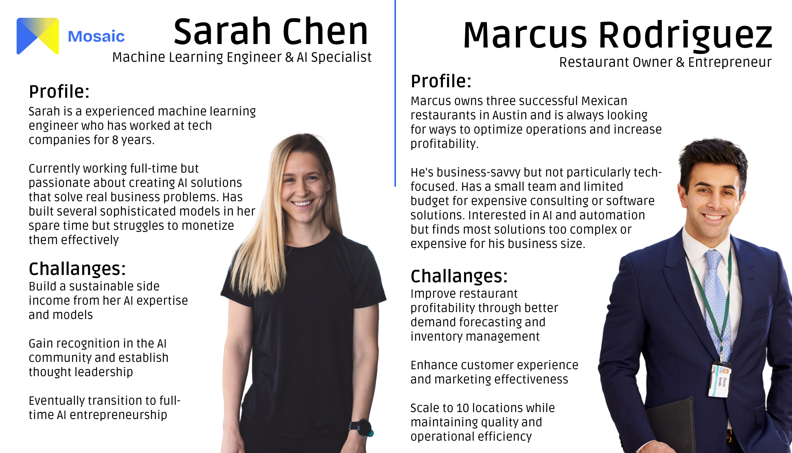
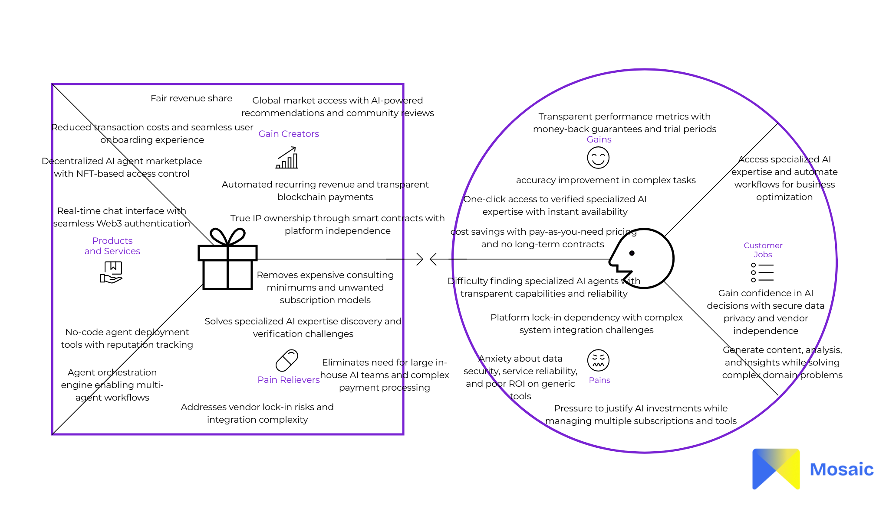

# 3. Solution

Mosaic rebuilds the AI economy from the ground up using three breakthrough innovations: NFT-based access control, creator-first economics, and decentralized infrastructure.

### The NFT Access Revolution

Instead of traditional subscriptions or one-time purchases, Mosaic introduces "access NFTs" - blockchain tokens that grant time-limited usage rights to specific AI agents. Think of them as digital keys that automatically expire after a set period.

Here's how it works: A business owner needs help with inventory forecasting for the next quarter. They purchase a 30-day access NFT for $150 that gives them unlimited conversations with a specialized logistics AI agent. After 30 days, the NFT automatically expires and gets burned from their wallet. No recurring charges, no forgotten subscriptions, no platform lock-in.

This model benefits everyone. Users pay only for what they need and own verifiable access rights. Creators get transparent, programmable revenue streams. The blockchain ensures that neither party depends on a centralized platform that could disappear or change terms.

### Creator-First Economics

Traditional platforms extract value from creators through high commission fees and opaque revenue sharing. Mosaic flips this model entirely.

Creators keep 85% of all revenue - the highest share in the industry. More importantly, they maintain true ownership of their AI agents through smart contracts. If Mosaic disappeared tomorrow, creators would still own their intellectual property and could deploy it elsewhere.

The platform supports multiple monetization strategies:

- **Micro-transactions** for quick consultations ($0.50 to $5)
- **Standard access** for weekly or monthly usage ($20 to $200) 
- **Enterprise licensing** for custom deployments ($10,000 to $100,000+)
- **Revenue sharing** for popular agents featured in the marketplace

Sarah Chen, our marketing analytics creator from earlier, could now offer her agent at multiple price points: $2 for a single analysis, $50 for monthly access, or $25,000 for an enterprise license with custom training data.

### Decentralized Infrastructure That Actually Works

Mosaic runs on Hedera Hashgraph, which processes transactions in 3-5 seconds for under $0.01 each. This makes micro-payments economically viable while maintaining enterprise-grade security and throughput.

Agent metadata and conversation history are stored on Walrus, a decentralized storage network that ensures data permanence without relying on any single provider. Users can export their data at any time, and agents remain accessible even if individual storage nodes go offline.

The technical architecture enables something that's never been possible before: truly portable AI services that users can access from anywhere, creators can deploy without platform risk, and enterprises can integrate without vendor lock-in.

### The User Experience Revolution

Despite the sophisticated blockchain infrastructure, Mosaic feels as simple as browsing an app store. Users can sign in with their existing Google or Twitter accounts through Privy's seamless authentication system, which creates and manages Web3 wallets automatically in the background. Users discover agents through intelligent categorization and search, preview capabilities through free interactions, and purchase access with a single click.

The chat interface supports rich media, real-time collaboration, and seamless handoffs between different specialized agents. An e-commerce business might start with a marketing agent for ad copy, then seamlessly transition to a logistics agent for supply chain optimization, all within the same conversation thread.

### Real-World Impact

Early beta testing shows remarkable results. AI creators report 3-5x higher revenue compared to traditional platforms, while users achieve 60-80% cost savings compared to consulting alternatives.

A small accounting firm used Mosaic to access specialized tax optimization agents during busy season, paying $800 for three months of access instead of hiring a $120,000/year specialist. The AI handled routine optimizations while their human accountants focused on complex client relationships.

A freelance data scientist deployed her customer churn prediction agent on Mosaic and generated $4,200 in revenue during the first month - more than she had earned from traditional consulting work in the previous quarter.

***"This sounds promising, but who exactly would use this?"***

## 3.1 Agent Orchestration Engine: Our Zapier for AI

One of Mosaic's most revolutionary features is its intelligent agent orchestration system - think of it as "Zapier for AI agents." This breakthrough technology allows users to create sophisticated multi-agent workflows without any coding knowledge.

### How Agent Orchestration Works

Instead of interacting with just one AI agent at a time, users can build complex workflows where multiple specialized agents work together seamlessly. The orchestrator agent acts as an intelligent conductor, automatically routing tasks to the most suitable agents based on their capabilities and reputation scores.

**Example Workflow: E-commerce Business Optimization**
```
User Input: "Help me optimize my online store for the holiday season"

Orchestrator Agent analyzes request → Routes to:
├── Market Research Agent (analyzes holiday trends)
├── Inventory Planning Agent (forecasts demand)  
├── Marketing Copy Agent (creates promotional content)
├── Pricing Strategy Agent (optimizes pricing)
└── Customer Service Agent (prepares support scripts)

Final output: Comprehensive holiday optimization plan
```

### Reputation-Based Agent Selection

The orchestrator doesn't just randomly assign tasks - it makes intelligent decisions based on a sophisticated reputation system that tracks:

- **Performance Metrics**: Response accuracy, task completion rates, user satisfaction scores
- **Specialization Depth**: How well an agent performs in specific domains
- **Collaboration History**: How effectively agents work together in multi-step workflows
- **Real-time Availability**: Current load and response times
- **Cost Efficiency**: Value delivered relative to pricing

**Smart Recommendations in Action:**
- High-reputation financial agents get priority for investment analysis tasks
- Agents with proven track records in specific industries are recommended first
- The system learns from successful workflow patterns and suggests optimal agent combinations
- Underperforming agents are gradually filtered out of recommendations

### No-Code Workflow Builder

Users can create these complex workflows through an intuitive drag-and-drop interface:

1. **Define Your Goal**: "I want to launch a new product"
2. **Add Workflow Steps**: Market research → Competitive analysis → Pricing strategy → Marketing plan
3. **Agent Auto-Assignment**: Orchestrator recommends the best agents for each step
4. **Connect Data Flow**: Output from one agent automatically feeds into the next
5. **Execute & Monitor**: Watch your multi-agent workflow run in real-time

### Advanced Orchestration Features

**Parallel Processing**: Multiple agents can work simultaneously on different aspects of the same project, dramatically reducing completion time.

**Dynamic Routing**: If an agent becomes unavailable or performs poorly, the orchestrator automatically reassigns tasks to backup agents without interrupting the workflow.

**Context Preservation**: All agents in a workflow share relevant context, ensuring consistent outputs and eliminating the need to repeat information.

**Quality Control**: The orchestrator includes built-in validation steps, where specialized review agents check outputs before proceeding to the next stage.

**Cost Optimization**: The system automatically balances cost and quality, suggesting more affordable agents for simpler tasks while reserving premium agents for complex operations.

### Real-World Impact

Early adopters report remarkable results from orchestrated workflows:

- **75% faster project completion** compared to single-agent interactions
- **40% cost reduction** through optimal agent selection and parallel processing  
- **90% accuracy improvement** in complex multi-step tasks
- **Zero workflow failures** due to intelligent backup and rerouting systems

A marketing agency used Mosaic's orchestration to create a complete campaign for a client: the Market Research Agent identified trending topics, the Content Creation Agent wrote blog posts, the SEO Agent optimized them, and the Analytics Agent set up tracking - all in 2 hours instead of the usual 2 weeks with human coordination.

### Enterprise Orchestration Capabilities

For businesses requiring advanced coordination:

- **Custom Workflow Templates**: Pre-built orchestration patterns for common business processes
- **API Integration**: Connect external systems to agent workflows  
- **Approval Gates**: Human review points in automated workflows
- **SLA Monitoring**: Track and guarantee performance metrics across agent teams
- **White-label Solutions**: Branded orchestration interfaces for enterprise clients

This orchestration engine transforms Mosaic from a simple AI marketplace into a comprehensive automation platform, where the sum of specialized agents becomes far greater than its parts.

***"Who would benefit most from this orchestration capability?"***

## 3.2 Personas

<sub>Figure 2 - User Personas</sub>



<sup>Source: Material produced by the authors (2025) | [View on Canva](https://www.canva.com/design/DAGgQwCzBa8/VKkLRE0mFBOaia_rLVcaKw/edit?utm_content=DAGgQwCzBa8&utm_campaign=designshare&utm_medium=link2&utm_source=sharebutton)</sup>

### Persona 1: Sarah Chen - AI Creator

**Name:** Sarah Chen  
**Age:** 32  
**Profession:** Machine Learning Engineer & AI Specialist  
**Location:** San Francisco, CA  

#### Profile
Sarah is a experienced machine learning engineer who has worked at tech companies for 8 years. She specializes in marketing analytics and customer behavior prediction models. Currently working full-time but passionate about creating AI solutions that solve real business problems. Has built several sophisticated models in her spare time but struggles to monetize them effectively.

#### Objectives
- **Primary Goal:** Build a sustainable side income from her AI expertise and models
- **Secondary Goal:** Gain recognition in the AI community and establish thought leadership
- **Long-term Vision:** Eventually transition to full-time AI entrepreneurship

#### Pain Points & Challenges
- **Monetization Struggles:** Current platforms take 40-50% commission, making it hard to build sustainable income
- **Limited Reach:** No effective way to market her specialized AI models to businesses that need them
- **Ownership Concerns:** Worried about losing control of her intellectual property on traditional platforms
- **Time Investment:** Spends too much time on client acquisition instead of developing better models
- **Pricing Uncertainty:** Doesn't know how to price her services competitively while maintaining profitability

#### Behaviors & Motivations
- **Tech-Savvy:** Comfortable with blockchain and new technologies
- **Quality-Focused:** Prioritizes building excellent models over quick monetization
- **Community-Oriented:** Active in AI/ML communities and enjoys helping others learn
- **Entrepreneurial:** Wants to build a business around her expertise
- **Values Autonomy:** Prefers platforms that give creators control and fair compensation

#### How Mosaic Helps Sarah
- **85% Revenue Share:** Keeps significantly more of her earnings compared to traditional platforms
- **NFT Ownership:** Maintains true ownership of her AI agents through blockchain technology
- **Flexible Pricing:** Can offer micro-transactions, monthly access, and enterprise licensing
- **Built-in Discovery:** Platform's search and recommendation system helps users find her specialized agents
- **Reputation System:** Builds credible track record through transparent performance metrics

### Persona 2: Marcus Rodriguez - Small Business Owner

**Name:** Marcus Rodriguez  
**Age:** 45  
**Profession:** Restaurant Owner & Entrepreneur  
**Location:** Austin, TX  

#### Profile
Marcus owns three successful Mexican restaurants in Austin and is always looking for ways to optimize operations and increase profitability. He's business-savvy but not particularly tech-focused. Has a small team and limited budget for expensive consulting or software solutions. Interested in AI and automation but finds most solutions too complex or expensive for his business size.

#### Objectives
- **Primary Goal:** Improve restaurant profitability through better demand forecasting and inventory management
- **Secondary Goal:** Enhance customer experience and marketing effectiveness
- **Long-term Vision:** Scale to 10 locations while maintaining quality and operational efficiency

#### Pain Points & Challenges
- **Expensive Consultants:** Traditional business consultants charge $10,000+ minimums, pricing out small businesses
- **Generic Solutions:** Most software doesn't understand the restaurant industry's unique challenges
- **Limited Tech Expertise:** Doesn't have time to learn complex systems or manage subscriptions
- **Seasonal Variability:** Struggles with demand forecasting during holidays and local events
- **Tight Margins:** Needs cost-effective solutions that provide clear ROI

#### Behaviors & Motivations
- **Results-Oriented:** Wants solutions that directly impact his bottom line
- **Practical:** Prefers simple, straightforward tools over complex systems
- **Budget-Conscious:** Carefully evaluates cost vs. benefit for any business investment
- **Industry-Focused:** Values expertise specific to restaurant/hospitality industry
- **Time-Constrained:** Needs solutions that work quickly without extensive setup

#### How Mosaic Helps Marcus
- **Affordable Access:** Pay $150 for 30 days of specialized inventory forecasting instead of $10,000 consulting
- **Industry Expertise:** Access to AI agents built specifically for restaurant operations
- **No Long-term Commitments:** Pay only for what he needs, when he needs it
- **Immediate Value:** Get actionable insights quickly without complex implementation
- **Agent Orchestration:** Multiple specialized agents work together (inventory + marketing + customer service) for comprehensive solutions

## 3.3 Value Proposition Canvas

<sub>Figure 3 - Value Proposition Canvas</sub>



<sup>Source: Material produced by the authors (2025) | [View on Canva](https://www.canva.com/design/DAGgQwCzBa8/VKkLRE0mFBOaia_rLVcaKw/edit?utm_content=DAGgQwCzBa8&utm_campaign=designshare&utm_medium=link2&utm_source=sharebutton) | Template from [Strategyzer](https://www.google.com/url?sa=i&url=https%3A%2F%2Fwww.strategyzer.com%2Flibrary%2Fthe-value-proposition-canvas&psig=AOvVaw1mu8QB2T4G5ERnVzEeuh9Y&ust=1738958698227000&source=images&cd=vfe&opi=89978449&ved=0CBQQjRxqFwoTCIDyvo3sr4sDFQAAAAAdAAAAABAE)</sup> 